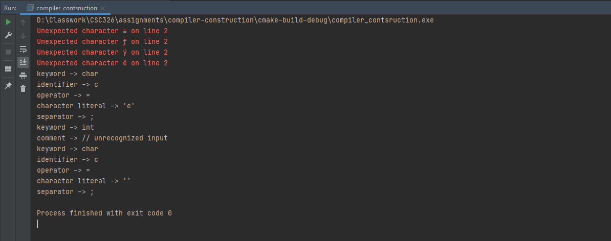

## C-Language Compiler Implementation

A compiler for a subset of the C programming language.

See the grammar [here](specification.txt). Or [this](spec_ll1.txt) for the LL(1) & updated version.

### Project Status

1. - [x] Lexical Analyzer
2. - [ ] Syntax Analyzer
3. - [ ] Semantic Analyzer
4. - [ ] Intermediate Code Generator
5. - [ ] Machine-Independent Code Optimizer
6. - [ ] Code Generator
7. - [ ] Machine-Dependent Code Optimizer

### Project Requirements

#### Compulsory

1. C++17 (preferably g++)

#### Optional

1. ANTLR - Test case generation

### Setup

1. Clone the project into your computer.
2. Launch the project by running the `main.cpp` file. It would be easier to run the project using JetBrain's CLION IDE.
3. The test files are found in the `tests` folder.
   - To switch from one testcase to another, you can:
     1. Use the Makefile i.e. `make o f=tests/submitted.c`
     2. or, when directly running the executable, `./main tests/submitted.c`
     3. or, change the name in the test file specifier on the `main.cpp` file

### Generating testcases using ANTLR

1. Install [ANTLR4](https://www.antlr.org/download.html)
2. Install [grammarinator](https://github.com/renatahodovan/grammarinator)
3. Run [generate.sh](generate.sh) which generates some test cases & runs them

### Illustrations

1. Scanner output
   
