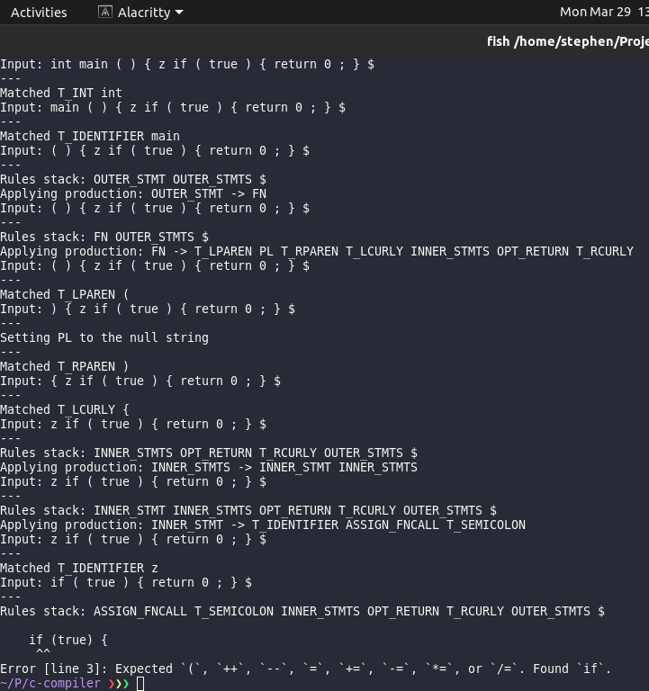

## C-Language Compiler Implementation

A compiler for a subset of the C programming language (written in C++).

See the grammar [here](specification.txt). (Or [this](assets/C.g4) for the ANTLR version).

The predictive table, FIRST, and, FOLLOW sets are available [here](https://docs.google.com/spreadsheets/d/1F-eJwgGijExL0FjVoafF_rrcgbAnOpWvMyG7Qhu3K1k/edit?usp=sharing).

### Project Status

1. - [x] Lexical Analyzer
2. - [x] Syntax Analyzer
3. - [ ] Semantic Analyzer
4. - [ ] Intermediate Code Generator
5. - [ ] Machine-Independent Code Optimizer
6. - [ ] Code Generator
7. - [ ] Machine-Dependent Code Optimizer

### Project Requirements

1. C++17 (preferably g++)

### Setup

1. Clone the project into your computer.
2. Launch the project by running the `main.cpp` file. It would be easier to run the project using JetBrain's CLION IDE.
3. The test files are found in the `tests` folder.
   - To switch from one testcase to another, you can:
     1. Use the Makefile i.e. `make o f=tests/submitted.c`
     2. or, when directly running the executable, `./main tests/submitted.c`
     3. or, change the name in the test file specifier on the `main.cpp` file

### Screenshots

1. Scanner output
   
2. Parser output
   
